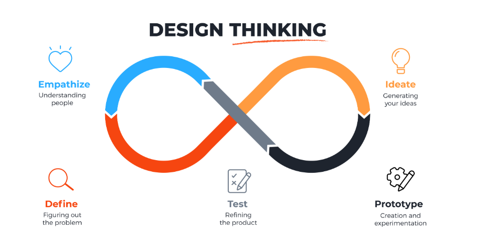
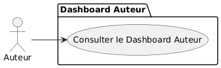
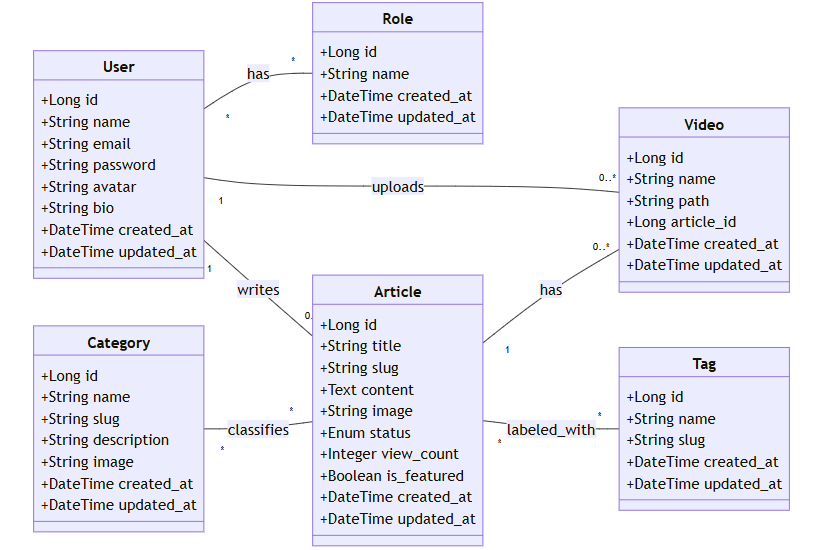

---
 
marp: true
theme: default
_class: lead
paginate: true
backgroundColor: #ffffffff
style: |
  section {
    font-size: 22px;
    color: #000000ff;
    line-height: 1.5;
    padding: 2.5em;
    
  }
  h1, h2, h3 {
    color: #38bdf8;
    font-weight: 700;
    margin-bottom: 0.6em;
  }
  h1 { font-size: 2.8em; }
  h2 { font-size: 2.2em; }
  h3 { font-size: 1.6em; color: #fbbf24; }
  p, li {
    font-size: 1.15em;
    margin-bottom: 0.6em;
  }
  ul, ol {
    margin-left: 1.4em;
    margin-bottom: 1.2em;
  }
  img {
    max-width: 85%;
    display: block;
    margin: 1em auto;
    border-radius: 8px;
    box-shadow: 0 4px 6px rgba(0,0,0,0.3);
  }
  .header-logos {
    display: flex;
    justify-content: space-between;
    align-items: center;
    margin-bottom: 0em;
  }

---

# **Projet Blog Solicode**
### **Sprint 2 – Dashboard Auteur & MVP**

**Réalisé par :** AZIZ Soufiane
**Encadré par :** M. ESSARRAJ Fouad

---

# Introduction & Contexte

Après la mise en place du front-office lors du Sprint 1, le **Sprint 2** se concentre sur :

- Mise en place du **Dashboard Auteur**
- Visualisation des statistiques
- Vision claire du MVP côté auteur

---

# Méthodologies
 Méthodologie ( SCRUM )

---

# Méthodologies
 Méthodologie ( design Thinking )

---

# Fonctionnalités du Dashboard Auteur

- Visualisation des **KPI** globaux (articles, vues)

- Voir les derniers articles publiés
- Suivi de l’activité récente

---

# Use Case MVP Auteur

---

# Labs réalisés

### Lab 1 : Ajax

---

# Maquette dashboard (Auteur)

---

# Validation de maquettes

## Youssef Yazidi

---

# Diagramme de classe

---

# Technologies utilisées

- Laravel 12 (MVC + Services)
- Blade Components
- TailwindCSS
- Preline UI
- GitHub (versionning & branches)

---

# Prochain Sprint

- Ajout section des **commentaires**
- Gestion des **utilisateurs**
- Gestion des **catégories**
- Ajout de graphiques et statistiques avancées pour l’Admin